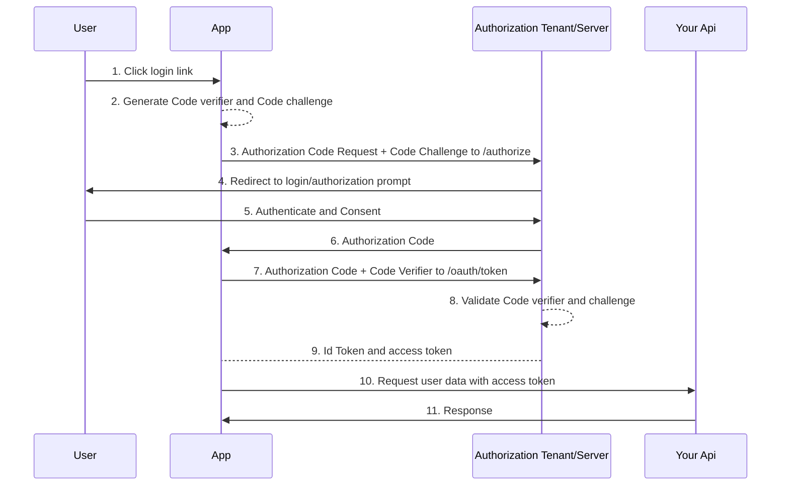

Reading about authentication and authorization got me worried, how am i suppose to properly secure my application to prevent security attacks - XSS and CSRF protection.

the plateu of answer on stackoverflow doesnt help as there are many answers on how to secure your application (dont use localStorage use http only secure cookies, use both access token and refresh token, store the refresh token in backend so that you can revoke refresh token)

but i guess according to OWASP standard, i would say since most application these days would want SSO, i would be focusing my attention to the OAUTH2 authentication and authorization protocols which requires an authentication server. 

> just to clarify what these terms mean:
> 
> - Oauth2 is an authorzation protocol to allow access to other providers
> - OpenId Connect is the authentication protocol that work on top of Oauth2, it has additional properties being passed that identifies the user
{: .prompt-info}

for a react based and some backend that you implemented, the workflow that suits this would be the [authorization code flow with Proof key for code exchange (PKCE)](https://auth0.com/docs/get-started/authentication-and-authorization-flow/authorization-code-flow-with-proof-key-for-code-exchange-pkce). this workflow is used since react is a Single page application (SPA)

for a list of methods that can be implemented, we can take alook at what oauth0 have 
listed as a [guide](https://auth0.com/docs/get-started/authentication-and-authorization-flow/which-oauth-2-0-flow-should-i-use). i believe most authentication SAAS providers would work in the same manner.



in addition, auth0 actually provides the option of implementing refresh token rotation so that if the refresh token is compromised, it can only be used once.

there are [example guides](https://developer.auth0.com/resources/code-samples/full-stack/hello-world/basic-role-based-access-control/spa/react-typescript-with-react-router-6/express-typescript) that auth0 comes out of the box for a login form and how to setup the full stack application. in the event you dont wish to be redirected to oauth own form page, you can create your own and tie it together with [auth0 api](https://auth0.com/docs/api/authentication?http#login)

the base idea here is that with such a workflow, if we want persistant logging, we would still need to enable localStorage as a cache location for our token, quote [here](https://auth0.com/docs/secure/security-guidance/data-security/token-storage#browser-in-memory-scenarios). but this should be fine even though it may be subseptible to xss attack since we have refresh token rotation in place. (of course with [warning](https://auth0.com/docs/secure/security-guidance/data-security/token-storage#browser-in-memory-scenarios)) allowing us to have seemless background refresh to persist session, as well as not having to manage to jwt authentication.

it being a paid solution, are there alternatives?

## thoughts

i guess the base question is, do we really need such a secure authentication mechanism? if we were to deploy applications on the cloud, we would be able to use service providers own authentication such as amazon cognito, azure ad b2c, firebase... 

doing a quick google search, there are alternatives like keycloak, ory.

## takeaways

it is important to know what would your audience be for your application. the base idea of authentication and authorization would be to ideally have some form of SSO if its to a global audience (not in house). security in place would be to sepearte api and authentication server where tokens would be use to after authentication. tokens should have short expiration date and to maintain sessions, a background refresh before expiry can be done to reload and issue new access and refresh token.

in a simple case where your application allows cookies. you can just use http-only cookies with secure for your refresh token and allow background refresh.

```typescript

interface ResponseType {
  expires_in: number;
  accessToken: string
}

const refreshToken = async () => {
  const response = await fetch("/your/refresh/endpoint")
  const {expires_in, accessToken} : ResponseType = await response.json()
  //...acces token can be in mem, refreshToken should be passed through via cookies
  //store token for use as authentication bearer for your api
  setTimeout(()=>{
    refreshToken()
  }, (expires_in * 1000)-500)

}

```